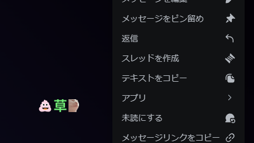

# What Is This
Discordのメッセージやらで使えるちょっとしたツール集です

## message.js
このプログラムは連続送信制限を無視して連続してメッセージを送信するものです。
### 利用方法
`env`ファイルの`メッセージ送信ツール`セクションの設定をしてください。

一度に送信するのは`10個`程度に抑えてください。

## reaction.js
このプログラムは設定ファイルに記載した絵文字のリアクションを一瞬でつけるものです。
### 利用方法
`env`ファイルの`リアクションツール`セクションの設定をしてください。

`EMOJI_LIST_FILE`には以下のようにして取得した絵文字IDを以下のフォーマットに合わせて記述したJSONファイルのパスを指定してください。

※絵文字が連続して付きにくい場合は、同期処理等の遅延をもって送れるようにコードを変更してください。


以下のように追加したい絵文字を書いたメッセージを右クリックしてテキストをコピーしてください。


そうしたら取得した絵文字IDを以下のJSON形式に書き直してください。(量は多いときはChatGPT等使うのをお勧めします)
```json
[
    "emojiname0:00000000000000000",
    "emojiname1:11111111111111111",
    "emojiname2:22222222222222222"
]
```
※`emojiname0`などとなってますが、これはJSON内で判別するためだけのものなので好きな名前を書いてもかまいません。
